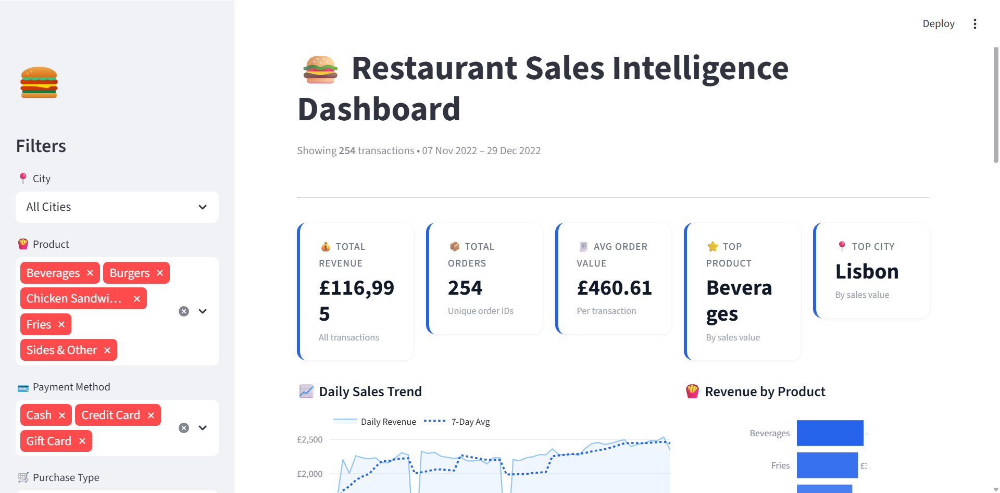
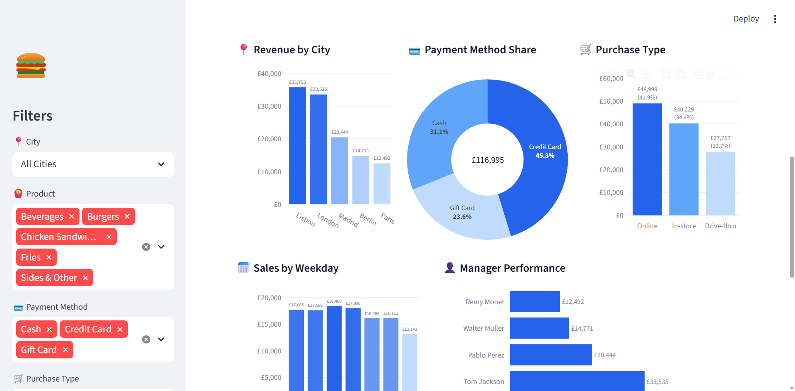
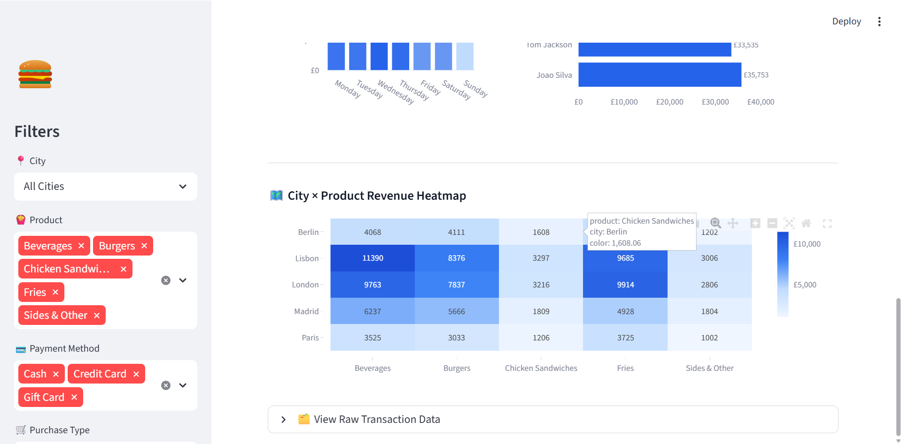

# Multi-City Restaurant Sales Intelligence Dashboard

# Dashboard Preview

## KPI Overview



---

## Business Insights Dashboard



---

## Product-City Revenue Heatmap



## Project Overview

This project is an end-to-end restaurant sales analytics and business intelligence project designed to simulate a real-world data analyst workflow.

The project analyzes multi-city restaurant transaction data to uncover:

- Revenue trends
- Product performance
- Customer purchasing behavior
- Regional sales patterns
- Payment preferences
- Online vs in-store purchasing trends

The project combines:

- Python-based data cleaning and exploratory data analysis (EDA)
- SQL business analysis using MySQL
- Data validation and semantic correction
- Business insight generation
- Visualization and dashboard preparation

This portfolio project was built to demonstrate practical business analytics skills for Junior Data Analyst / BI Analyst roles.

---

# Business Objectives

The main objective of this project is to analyze restaurant transaction data and identify actionable business insights that could support operational and strategic decision-making.

Key business questions include:

## Revenue Analysis

- Which cities generate the highest sales value?
- Which products contribute most to revenue?
- What are the overall transaction patterns?

## Customer Behavior Analysis

- Which payment methods are most popular?
- Do customers prefer online or in-store purchases?
- Are there noticeable weekday or seasonal trends?

## Operational Insights

- Which products should receive stronger marketing focus?
- Which regions may require operational improvement?
- How can sales channels be optimized?

---

# Tools & Technologies

| Category | Tools |
|---|---|
| Programming | Python |
| Data Analysis | Pandas, NumPy |
| Visualization | Matplotlib, Seaborn, Plotly |
| Database | MySQL |
| SQL Client | SQLyog |
| Notebook Environment | Jupyter Notebook |
| Version Control | Git & GitHub |
| Dashboard | Streamlit, Plotly |

---

# Project Structure

```text
restaurant-sales-analysis/
│── dashboard/
│   └── dashboard.py
│   └── requirements_dashboard.txt
│
├── data/
│   └── Sales-Data-Analysis.csv
│
├── output/
│   ├── cleaned_sales_data.csv
│   └── restaurant_sales_analysis.csv
│   └── figures/
│       ├── city_sales_analysis.png
│       ├── correlation_heatmap.png
│       ├── daily_sales_trend.png
│       ├── payment_method_analysis.png
│       ├── product_sales_analysis.png
│       └── purchase_type_analysis.png
│   └── dashboard_screenshot
│       ├── dashboard_overview.png
│       ├── business_insights_dashboard.png
│       └── product_city_heatmap.png
│
├── sql/
│   └── restaurant_sales_analysis.sql
│
├── main.py
├── requirements.txt
└── README.md
```

---

# Dataset Information

## Dataset Characteristics

| Attribute | Description |
|---|---|
| Dataset Type | Simulated Restaurant Transaction Data |
| Records | 254 rows |
| Features | 9+ columns |
| Scope | Multi-city restaurant operations |
| Format | CSV |

## Original Dataset Columns

| Column | Description |
|---|---|
| Order ID | Unique transaction identifier |
| Date | Transaction date |
| Product | Product category |
| Price | Product price |
| Quantity | Originally labeled quantity |
| Purchase Type | Online / In-store |
| Payment Method | Credit Card / Cash / Gift Card |
| Manager | Store manager |
| City | Transaction city |

---

# Data Validation Findings

One of the most important parts of this project involved validating the semantic meaning of dataset fields.

During exploratory analysis, the original `Quantity` column was identified as inconsistent with realistic transactional quantity behavior.

## Observations

Examples from the dataset:

| Price | Quantity |
|---|---|
| 3.49 | 573.07 |
| 2.95 | 745.76 |
| 12.99 | 569.67 |

These values are unrealistic for actual item quantities because:

- Quantities should generally be integers
- Restaurant orders rarely contain hundreds of units per transaction
- Decimal quantities are inconsistent with standard restaurant sales

## Analytical Conclusion

The column likely represented:

- Sales amount
- Transaction value
- Revenue metric

rather than actual item quantity.

## Corrective Action

The column was renamed:

```python
Quantity → Sales_Value
```

This improved the analytical accuracy of the project.

---

# Data Cleaning Process

The following data cleaning and preprocessing steps were performed.

## 1. Missing Value Detection

```python
df.isnull().sum()
```

Verified that the dataset contained no missing values.

---

## 2. Duplicate Detection

```python
df.duplicated().sum()
```

Duplicate rows were checked and removed.

---

## 3. Date Standardization

The dataset used European-style dates:

```text
13-11-2022
```

Dates were converted using:

```python
pd.to_datetime(df['Date'], dayfirst=True)
```

---

## 4. Feature Engineering

Additional time-based features were generated:

- Year
- Month
- Month_Name
- Weekday

---

## 5. Data Validation

Business logic validation was applied to identify semantic inconsistencies in the dataset.

---

# Exploratory Data Analysis (EDA)

The project includes multiple business-oriented analytical components.

---

# KPI Analysis

Key business KPIs were calculated.

## KPIs Included

- Total Sales Value
- Total Orders
- Average Transaction Value
- Top Product
- Top Performing City

Example:

```python
total_sales = df['Sales_Value'].sum()
```

---

# Time Series Analysis

Daily sales trends were analyzed to identify transaction patterns over time.

## Visualization

Generated output:

```text
output/figures/daily_sales_trend.png
```

## Business Value

This analysis helps businesses:

- Detect peak sales periods
- Understand temporal demand patterns
- Improve operational planning

---

# Product Performance Analysis

Product-level analysis was performed to identify high-performing categories.

## Analysis Included

- Sales value by product
- Product ranking
- Revenue contribution comparison

## Visualization

```text
output/figures/product_sales_analysis.png
```

## Example Insight

High-performing product categories contribute disproportionately to total revenue.

---

# City Performance Analysis

Regional sales performance was compared across multiple cities.

## Analysis Included

- Sales value by city
- Regional ranking
- City contribution analysis

## Visualization

```text
output/figures/city_sales_analysis.png
```

## Business Importance

This type of analysis supports:

- Regional marketing strategy
- Resource allocation
- Expansion decisions

---

# Payment Method Analysis

Payment channel behavior was analyzed to understand transaction preferences.

## Analysis Included

- Payment method distribution
- Sales contribution by payment type

## Visualization

```text
output/figures/payment_method_analysis.png
```

## Business Importance

Understanding payment behavior can support:

- Digital payment strategy
- Customer experience optimization
- Payment partnership decisions

---

# Purchase Type Analysis

Customer purchasing channels were analyzed.

## Categories

- Online
- In-store

## Visualization

```text
output/figures/purchase_type_analysis.png
```

## Example Insight

Online and in-store transaction behaviors show measurable differences.

---

# Correlation Analysis

Correlation analysis was performed between:

- Product price
- Sales value

## Visualization

```text
output/figures/correlation_heatmap.png
```

## Findings

The correlation between Price and Sales_Value is **-0.26**, indicating a weak negative relationship. This means higher-priced items (Burgers at £12.99, Chicken Sandwiches at £9.95) do not generate proportionally higher Sales_Value per transaction compared to lower-priced items like Beverages (£2.95) and Fries (£3.49).

This is consistent with the product analysis results: Beverages and Fries — the two cheapest items — are also the top two revenue generators. The data suggests that **volume-driven, low-price products are the primary revenue engine**, rather than high-margin individual items — an important consideration for menu pricing and promotional strategy.

---

# Business Insights

Several business insights were generated from the analysis.

## Key Findings

### 1. Revenue Concentration in Core Products

Beverages (29.9%), Fries (27.4%), and Burgers (24.8%) together account for **82.1% of total revenue** (£96,039 out of £116,995). Chicken Sandwiches and Sides & Other contribute only 17.9% combined. This concentration suggests the business should prioritise availability and promotion of these three core categories, while evaluating whether the tail-end products justify their operational cost.

---

### 2. Strong Regional Concentration — Lisbon and London Lead

Lisbon (£35,753 / 30.6%) and London (£33,535 / 28.7%) together generate **59.2% of total revenue**, while Paris contributes only £12,492 (10.7%) — less than one-third of Lisbon's output. This gap suggests Lisbon and London branches are significantly outperforming peers and may warrant investigation into what operational or customer factors drive their success, with findings potentially applied to underperforming locations.

---

### 3. Online Channel Dominates Purchase Type

Online orders account for **41.9% of revenue** (£48,999), compared to In-store at 34.4% (£40,229) and Drive-thru at 23.7% (£27,767). Online sales are **76.5% higher** than Drive-thru, indicating a strong digital customer base. This supports continued investment in the online ordering experience and potential de-prioritisation of Drive-thru infrastructure.

---

### 4. Credit Card is the Dominant Payment Method

Credit Card accounts for **45.3% of sales** (£52,971), followed by Cash at 31.1% (£36,390) and Gift Card at 23.6% (£27,635). The relatively high Gift Card share (nearly a quarter of revenue) is notable — it may indicate the effectiveness of gift card promotions or loyalty programmes, and warrants further tracking to understand redemption patterns.

---

### 5. Importance of Data Validation

Business validation identified a critical semantic inconsistency: the original `Quantity` column contained large decimal values (e.g. 573.07, 745.76) inconsistent with actual item quantities. The column was re-identified as a **Sales Value metric** and renamed accordingly. Without this validation step, all downstream KPI calculations would have been fundamentally misleading. This highlights the importance of combining domain knowledge with technical analysis before drawing conclusions from raw data.

---

# SQL Analysis

The project includes SQL-based business analysis using MySQL.

## SQL Tasks Performed

- Total sales calculation
- Product ranking
- City ranking
- Payment analysis
- Monthly sales trends
- Weekday analysis

## Example SQL Query

```sql
SELECT
    city,
    SUM(sales_value) AS total_sales
FROM sales
GROUP BY city
ORDER BY total_sales DESC;
```

---

# Generated Visualizations

The project automatically generates multiple charts.

| Visualization | File |
|---|---|
| Daily Sales Trend | daily_sales_trend.png |
| Product Analysis | product_sales_analysis.png |
| City Analysis | city_sales_analysis.png |
| Payment Analysis | payment_method_analysis.png |
| Purchase Type Analysis | purchase_type_analysis.png |
| Correlation Heatmap | correlation_heatmap.png |

---

# How to Run This Project

## 1. Clone Repository

```bash
git clone https://github.com/yourusername/restaurant-sales-analysis.git
```

---

## 2. Install Dependencies

```bash
pip install -r requirements.txt
```

---

## 3. Run Python Analysis

```bash
python main.py
```

---

## 4. Run SQL Analysis

Import:

```text
output/cleaned_sales_data.csv
```

into MySQL / SQLyog.

Then execute:

```text
sql/sales_analysis.sql
```

---

# Skills Demonstrated

This project demonstrates practical experience in:

## Technical Skills

- Python data analysis
- SQL querying
- Data cleaning
- Exploratory data analysis
- Data visualization
- MySQL database analysis
- ETL workflow

## Business Skills

- KPI analysis
- Business insight generation
- Revenue analysis
- Customer behavior analysis
- Data validation
- Analytical reasoning

---

# Future Improvements

Potential future upgrades include:

## Dashboard Enhancements

- Additional executive KPI views
- Mobile-responsive layout optimization
- Advanced filtering and drill-down analytics
- Cloud deployment for public access

## Advanced Analytics

- Sales forecasting
- Time series modeling
- Machine learning prediction

## Data Engineering

- Automated ETL pipeline
- API integration
- Real-time dashboard updates

## Deployment

- Streamlit dashboard deployment
- Cloud database integration
- Web application version

---

# Author

## Wanti Huang

- MSc Software Engineering
- Data Analytics & Business Intelligence Portfolio Project
- Focus Areas:
  - Data Analysis
  - BI Analytics
  - SQL & Python
  - Business Intelligence

---

# Project Purpose

This project was created as a practical portfolio project to demonstrate real-world data analytics workflows and business analysis capabilities for entry-level data analyst and BI analyst opportunities.

